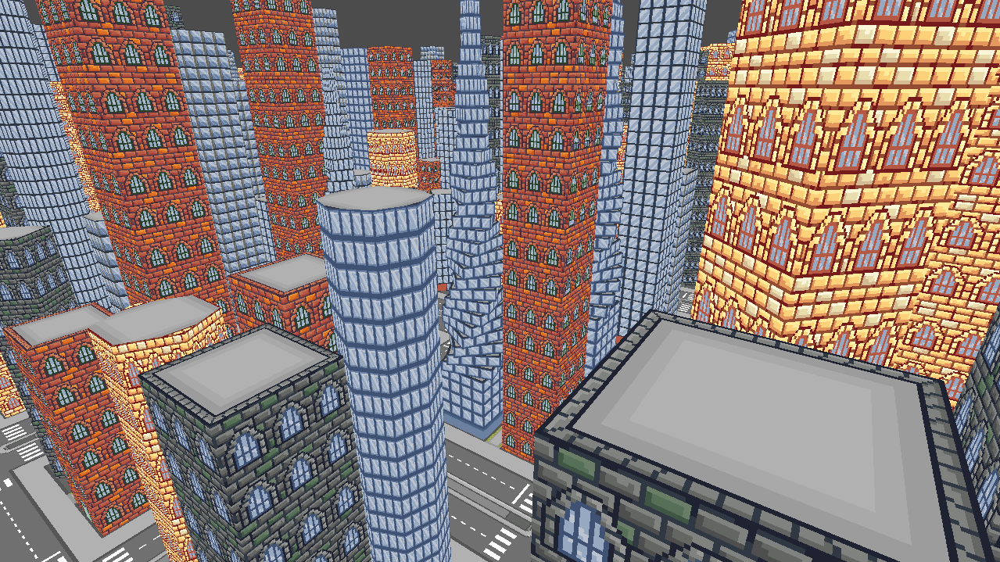
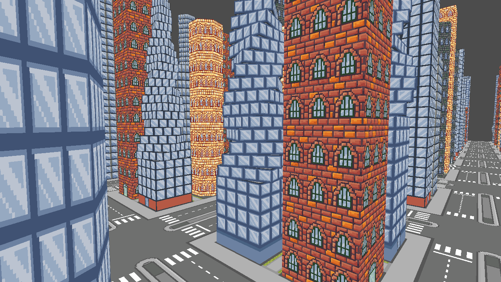

# CityScape (2023)
by Shaun Yin Sen Lee

Supervisor: Gordon Wood

CHANGELOG.md contains all documented changes.

**Video Preview:** 

**Image Preview:** 

## Introduction
Cityscape is a procedurally-generated city created using the OpenGL API. The aim of this project is to construct
an explorable, random cityscape, where buildings have different shapes and sizes. This project uses *Wolf*, a partial
engine created by Gordon Wood.

## Controls
- Use the WASD keys and mouse for first-person movement.
- Use Left-Control to sprint.
- Use Spacebar to ascend and Left-Shift to descend.
- Press R to regenerate the world.
- Press B to perform a very cool action.

## Core Features
**1. Building Generation** 
The cityscape composes of cuboid buildings. Each building is built using components that are placed on top of one
another, each offsetting the previous building. Each building consist of windows, a door, and roof textures. The 
building generation and itsrandomization is handled by EntityManager.

**2. Varing Heights and Sizes** 
Buildings have various height. This is done by determing how many floors to add for the building. There are also 
different buildings that come with different sizes (more on *Building Shapes* below).

**3. Grid-Like Generation of Buildings** 
There are four buildings geneated in a chunk of land. The buildings are slightly offset from the middle of the chunk and
from each other. The outer parts of the chunk consists of the road.

When buildings are placed on the land, their front face (the face with a door) will always face towards the roadside.
Since every building has two corners, each building may face one of two sides. Some randomization is added to which 
side of the road it will face.

**4. Minimum of 400 Buildings** 
The project must be able to support at least 400 buildings with a reasonable framerate.

**5. Regenerating the World** 
When hitting the R key, the world should destruct and regenerate. Upon regenerating, the buildings should be randomized
again.

**6. First Person Camera** 
The first person camera allows the user to look and move around. I wanted to design a camera similar to Minecraft's
smooth camera movements.

## Extra Features Implemented
**Road Generation** 
Each chunk contains a road texture. The road's texture is designed to scale correctly with the buildings, calculated 
to offset the buildings correctly and planning the art designs according to scale. Roads also have an 
"extension-like pattern", visually complementing additional road chunks that are next to each other.

**Building Shapes** 
There are 3 types of buildings in the world: standard buildings, polygons, and spirals. Standard buildings are regular
cuboid buildings that compliment any texture well, as textures are specifically designed for them.

Polygon buildings are built from prisms using a complex polygon generator algorithm. The algorithm will generate the 
vertex and index data for the polygon building.

The spiral building starts out with a regular base. At a certain point of the building, each floor with be slightly 
smaller than the previous and has a slight offset. This creates a spiral-like look, hoping to mimic some unique 
real-world buildings with that design.

## Side Features Implemented
**Texture Atlassing** 
Texture atlassing allowed me to store many textures within one file and use a single static texture variable for all of
my buildings.

**N-Sided Prism Generator** 
The n-sided prism generator allows the user to input the amount of sides, where sides > 3, to generate any polygon. It
uses trigonometric calculations to generate the sides. Another method helps to generate the indices of the prism.

**Textures Randomly Chosen in a Set** 
While textures are randomized, they are randomized in fixed texture sets. This allows the building to look consistent
with its design while providing randomization, where a building can be one of many texture sets.

**Custom-Draw Pixel Art** 
All artwork used in the project has been custom-drawn using Aseprite.

## Challenges
**Deciding on the program's architecture** 
It was challenging to design the architecture as I had different classes of buildings, where each building class had
varying components, textxures, and sizes. I considered a few different design patterns, including the Strategy Pattern
and Decorator pattern, but I struggled to understand how I could implement the code to work with those patterns. I also
researched on an Entity Component System (ECS). While this is possible and preferred in many types of games, creating
this cityscape using ECS would require me to learn from the beginning. With the time I have to finish the project, there
it was best that I used a different technique.

In the end, I used inheritance for my Building classes, where the program creates buildings using the child classes of
Building. This allowed removing a lot of boilerplate code for easy maintenance. While the flexibility of inheritance is
limited, it is sufficient for this time-critical project.

This project has enlighened me with the strengths of ECS, and I will continue to explore its possbilities in the future.

**Deciding where to construct the VAOs, VBOs, IBOs, and Textures** 
I spent a lot of time determining where to put the the buffers and textures. As the Building class is the parent of the
PolygonBuilding, SpiralBuilding, and StandardBuilding child classes, my initial thought was to place all buffers and
textures at the highest hierarchy of inheritance. However, I have understood that different buildings will need to have
their own buffers as they have unique vertices and indices, while textures can be handled by the Building parent class
as I use texture atlassing.

**Creating the n-sided prism generator** 
Handling the mathematics behind the n-sided prism generator was very complex,taking a lot of time. There
were many errors relating to the vertex and index data related to the algorithm. However, it worked out in the end, and 
I am grateful for the experience.

**Scaling artwork with pixel objects** 
My texture designs have to scale correctly with the buildings and other objects. This was a challenge to accomplish,
requiring creating ways of scaling my art correctly when designing it while playing around with texture atlassing.

## Stretch Goals Unimplemented
**Lighting** 
Lighting would greatly improve the aesthetics of the world, but it would require a lot of time to not just implement
it but also to rework all of the textures so they work with lighting.

**More Building Models, Street Lamps, Benches, and Other Entities** 
With the n-polygon prism geenrator and flexible component methods, we can create interesting shapes for many different 
entities. This would require more work, especially when textures have to accomodate for the new entities.

**Better Building Details** 
I would like to include more details into the building, adding differnet roof designs and small components, such as
signboards, air conditioning exhaust units, or water storage attachments.

**Art Rework** 
I would love to add more building texture variety as well as rework the existing artwork.

**Skybox** 
A skybox would help beautify the external world. Althogh I have explored the idea of it, implementing it would require 
more time.

**Face Culling** 
Face culling would remove textures that are within buildings or entities where the player should not be seeing. This
would improve the frame rate. However, the method of creating buildings would be complex and requires restructurin the 
code.

**Code Optimization and Cleanup** 
The code could be better optimised. For example, I would find a way to categorize both Buildings and Land as children 
of an Entity class as they share many similarities. Adding new entities, such as street lamps, should also fall under 
the Entity class.

**Moving Vehicles** 
I have the idea of making moving vehicles that travel from one part of the city to another. They would spawn at the
edges of the world and disappear when they reach the opposite side.

**Day/Night Cycle** 
A day-night cycle would require lighting to be implemented first.

**Rain Particles** 
I would allow rain particles to be toggled on and off for extra visual effects. The sky would also darken as the rain
comes.

## Final Thoughts
I am very grateful for this opportunity to learn about computer graphics programming. Although the project has room for 
improvement, it was very humbling yet empowering experience. I am confident that this experience will help me develop 
better projects in the future.